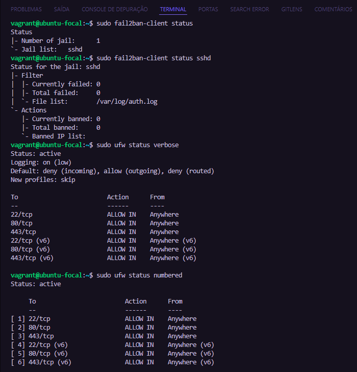
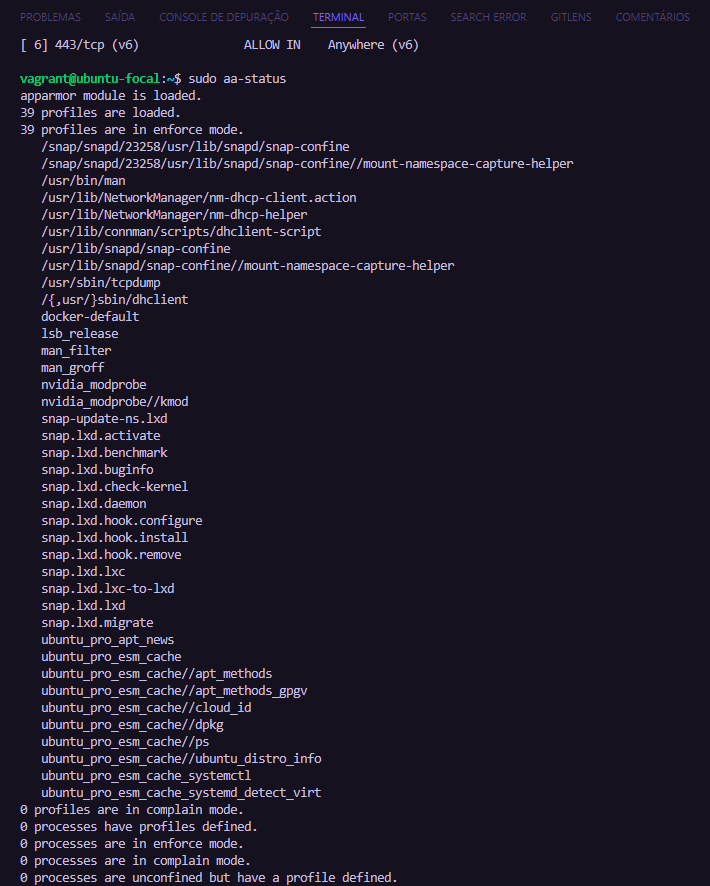
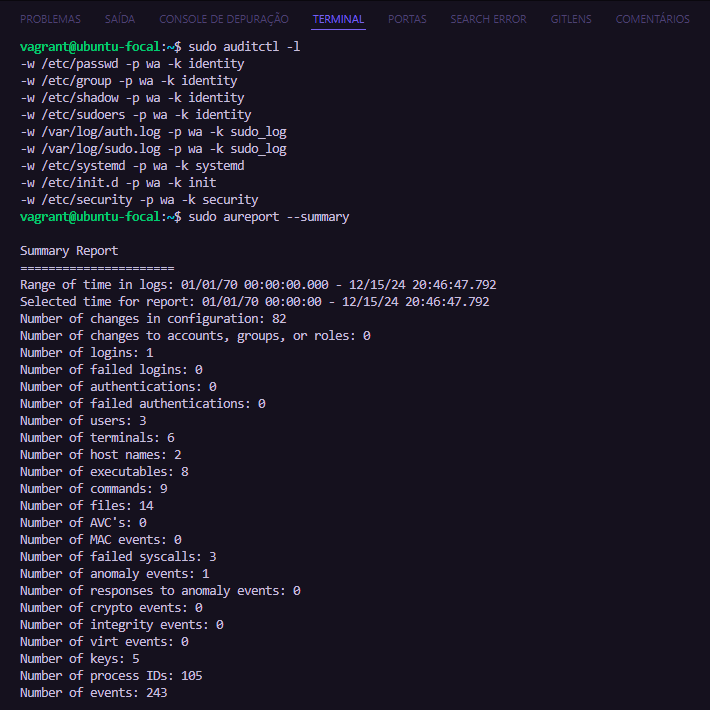
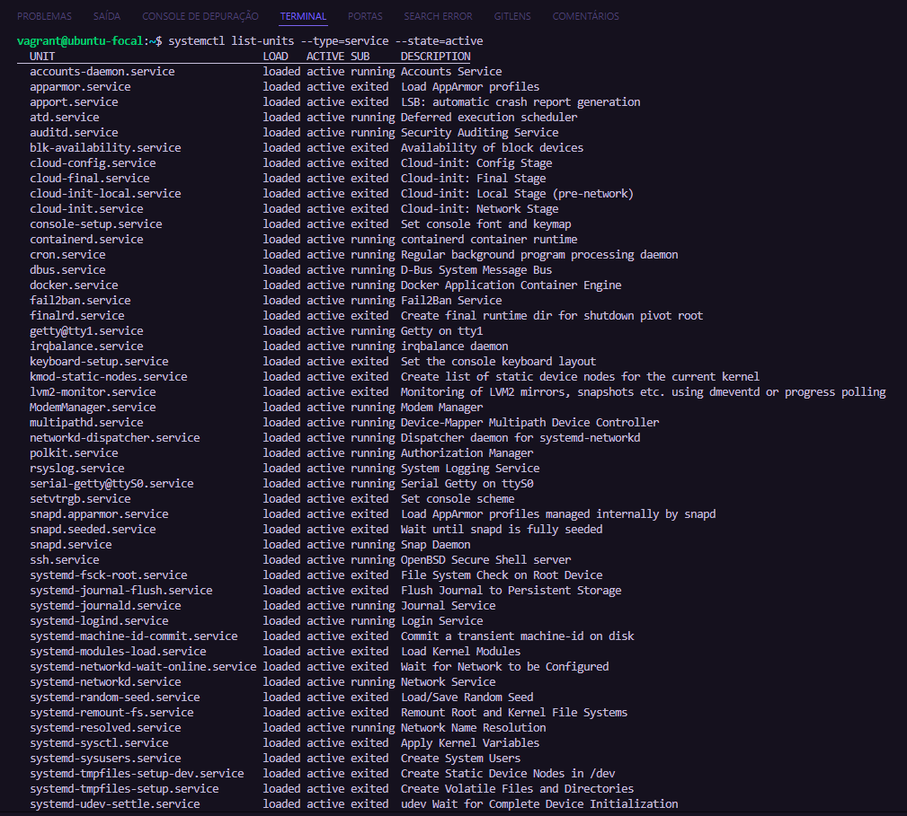
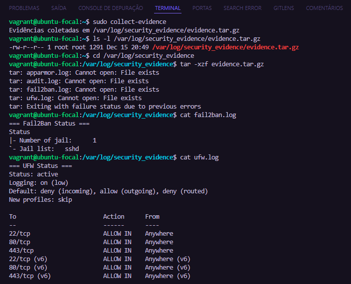
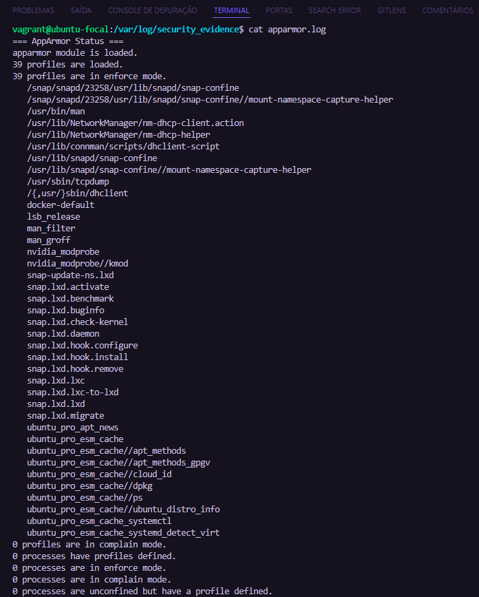
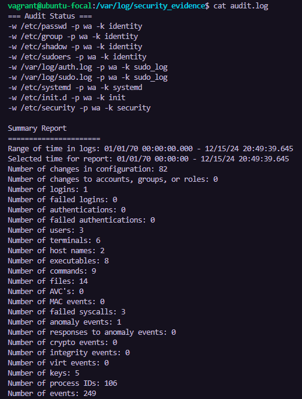

# Servidor Web Seguro

## Descrição
Este projeto tem como objetivo implementar um servidor web seguro com foco em hardening e boas práticas de segurança. O servidor é provisionado automaticamente usando o Vagrant e Docker. Além disso, todas as configurações de segurança, como **Fail2Ban**, **AppArmor**, **UFW** e **SSH** seguro, são aplicadas. A aplicação web é executada dentro de um contêiner Docker.
Projeto desenvolvido para a disciplina de Segurança da Informação - IF Goiano Campus Ceres.

## Estrutura do Projeto
```
.
├── Vagrantfile           # Configuração da máquina virtual
├── docker-compose.yml    # Configuração do Docker Compose
├── script.sh             # Script de hardening
├── src/                  # Arquivos da aplicação web
│   ├── index.html
│   ├── style.css
│   └── script.js
└── README.md             # Documentação
```

## Requisitos
- **VirtualBox**
- **Vagrant**
- **Docker**
- **Docker Compose**
  
## Implementação


### 1. Planejamento do Hardware
A máquina virtual foi configurada com as seguintes especificações:
- 1 GB de RAM
- 2 CPUs
- Ubuntu 20.04 LTS

### 2. Instalação e Configuração do Sistema Operacional
O servidor é provisionado automaticamente via **Vagrantfile** e o sistema operacional Ubuntu 20.04 LTS é configurado com as dependências necessárias.

### 3. Implementação de Hardening
O script de hardening **script.sh** realiza as seguintes ações:
- Atualizações automáticas
- Instalação e configuração de **Fail2Ban**
- Configuração do **AppArmor**
- Configuração do firewall **UFW**
- Desabilitação de serviços não essenciais
- Configuração de **SSH seguro**
- Instalação de **auditd** para auditoria de segurança

### 4. Docker e Docker Compose
A aplicação web é executada dentro de um contêiner Docker, configurado via **docker-compose.yml**. O Docker e o Docker Compose são instalados no servidor.

### 5. Como Usar

1. Clone o repositório:
```bash
git clone [https://github.com/JVSecundo/servidor_hosp.git]
cd [servidor_hosp]
```
2. Inicie a máquina virtual:
```bash
vagrant up
```

3. Acesse a máquina virtual:
```bash
vagrant ssh
```

4.  Inicie o Docker Compose  
```bash
cd /vagrant
sudo docker-compose up -d
```
**Se o comando retornar um erro, é porque o Docker Compose não está instalado corretamente.**

**Baixar a versão mais recente do Docker Compose**

Usar wget com Tolerância a Falhas, o **wget** é mais robusto para redes instáveis.

```bash
sudo apt-get install -y wget

sudo wget --tries=20 --continue -O /usr/local/bin/docker-compose "https://github.com/docker/compose/releases/download/1.29.2/docker-compose-$(uname -s)-$(uname -m)"

```

**Tornar o arquivo executável**

```bash
sudo chmod +x /usr/local/bin/docker-compose

```

**Verifique a versão instalada**

```bash
docker-compose --version

```

**Executar o Compose: Executar o projeto com**

```bash
sudo docker-compose up -d

```

**Visualizar os logs de um serviço gerenciado pelo Docker Compose**

```bash
sudo docker-compose logs

```


5. O servidor web estará disponível em:
```bash
http://localhost:8080
```

## Verificação de Segurança

Após a execução do script de hardening, você pode verificar o status dos serviços de segurança usando os seguintes comandos:

### 1. Verificar Status do Fail2Ban
```bash
# Ver status geral do Fail2Ban
sudo fail2ban-client status

# Ver status específico da jail SSH
sudo fail2ban-client status sshd
```

### 2. Verificar Status do Firewall (UFW)
```bash
# Ver status e regras ativas
sudo ufw status verbose

# Ver regras numeradas (útil para gerenciamento)
sudo ufw status numbered
```

### 3. Verificar Status do AppArmor
```bash
# Ver status do AppArmor
sudo aa-status
```

### 4. Verificar Status do Auditd
```bash
# Ver regras de auditoria ativas
sudo auditctl -l

# Ver resumo dos eventos de auditoria
sudo aureport --summary
```

### 5. Verificar Todos os Serviços Ativos
```bash
# Listar serviços ativos
systemctl list-units --type=service --state=active
```

## Coletando Evidências de Hardening

Para facilitar a coleta de evidências durante a apresentação, use o script automatizado:

```bash
sudo collect-evidence
```

Este comando irá:
1. Criar um diretório `/var/log/security_evidence`
2. Coletar status de todos os serviços de segurança
3. Gerar um arquivo compactado com todas as evidências

### Verificando as Evidências Coletadas

Após executar o script de coleta, você pode verificar as evidências:

```bash
# Ver o arquivo de evidências gerado
ls -l /var/log/security_evidence/evidence.tar.gz

# Extrair e ver o conteúdo
cd /var/log/security_evidence
tar -xzf evidence.tar.gz
cat fail2ban.log
cat ufw.log
cat apparmor.log
cat audit.log
```

# Servidor Web Seguro

[...conteúdo anterior até a seção de Testando as Medidas de Segurança...]

## Testando as Medidas de Segurança

### Preparação para os Testes
1. Primeiro, acesse sua máquina virtual Vagrant:
```bash
vagrant ssh
```

### Testes de Segurança

#### 1. Teste do Fail2Ban
Para simular tentativas de login SSH incorretas:
```bash
# Em um novo terminal, tente logar com usuário inválido
# Use o IP da sua máquina virtual (geralmente 127.0.0.1 porta 2222 para Vagrant)
ssh usuario_invalido@127.0.0.1 -p 2222
```
Repita algumas vezes com senhas incorretas.

Para verificar se o Fail2Ban bloqueou o IP:
```bash
sudo fail2ban-client status sshd
```
Você deverá ver "Currently banned IPs: 1" e seu IP na lista.

#### 2. Teste do Firewall (UFW)
```bash
# Verificar status do UFW
sudo ufw status

# Em outro terminal, teste uma porta bloqueada
# No Windows/PowerShell:
Test-NetConnection -ComputerName localhost -Port 8080

# Ver logs em tempo real:
sudo tail -f /var/log/kern.log | grep UFW

# Ou verificar todos os logs do UFW:
sudo grep UFW /var/log/kern.log
```

#### 3. Teste do Auditd
```bash
# Fazer alteração em arquivo monitorado:
sudo touch /etc/passwd

# Verificar os logs:
sudo ausearch -f /etc/passwd -ts recent
```

### Verificação de Serviços e Configurações
```bash
# Verificar status dos serviços
sudo systemctl status fail2ban
sudo systemctl status ufw
sudo systemctl status auditd

# Verificar configurações
sudo cat /etc/fail2ban/jail.local    # Configuração do Fail2Ban
sudo ufw show raw                    # Regras do UFW
sudo auditctl -l                     # Regras do Auditd
```

### Resolvendo Bloqueio do Fail2Ban

Se você foi bloqueado pelo Fail2Ban durante os testes, siga estes passos:

1. Acesse a VM pelo VirtualBox:
   - Abra o VirtualBox
   - Localize sua VM (nome como "servidor_hosp_default_...")
   - Clique em "Mostrar"
   - Login: vagrant
   - Senha: vagrant

2. Desbloqueie seu IP:
```bash
# Ver IPs banidos
sudo fail2ban-client status sshd

# Desbanir um IP específico
sudo fail2ban-client set sshd unbanip SEU_IP

# Ou desbanir todos os IPs
sudo fail2ban-client unban --all
```

3. Para evitar bloqueios durante testes:
```bash
# Editar configuração do Fail2Ban
sudo nano /etc/fail2ban/jail.local

# Altere maxretry = 3 para maxretry = 10

# Reinicie o Fail2Ban
sudo systemctl restart fail2ban
```

### Apresentação do Projeto


1. **IMG Provisionamento Automático**


2. **IMG Docker compose em execução**


3. **IMG Verificando de Segurança**









**Logs Docker**

3. **IMG a Aplicação Web**


4. **IMG Logs de Segurança**

   
## Autores
Nikolas de Hor, João Victor Secundo

## Professor Orientador
Roitier Campos Gonçalves
