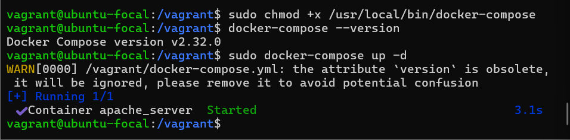

# Servidor Web Seguro

## Descrição
Este projeto tem como objetivo implementar um servidor web seguro com foco em hardening e boas práticas de segurança. O servidor é provisionado automaticamente usando o Vagrant e Docker. Além disso, todas as configurações de segurança, como **Fail2Ban**, **AppArmor**, **UFW** e **SSH** seguro, são aplicadas. A aplicação web é executada dentro de um contêiner Docker.
Projeto desenvolvido para a disciplina de Segurança da Informação - IF Goiano Campus Ceres.

## Estrutura do Projeto
```
.
├── Vagrantfile           # Configuração da máquina virtual
├── docker-compose.yml    # Configuração do Docker Compose
├── script.sh             # Script de hardening
├── src/                  # Arquivos da aplicação web
│   ├── index.html
│   ├── style.css
│   └── script.js
└── README.md             # Documentação
```

## Requisitos
- **VirtualBox**
- **Vagrant**
- **Docker**
- **Docker Compose**
  
## Implementação


### 1. Planejamento do Hardware
A máquina virtual foi configurada com as seguintes especificações:
- 1 GB de RAM
- 2 CPUs
- Ubuntu 20.04 LTS

### 2. Instalação e Configuração do Sistema Operacional
O servidor é provisionado automaticamente via **Vagrantfile** e o sistema operacional Ubuntu 20.04 LTS é configurado com as dependências necessárias.

### 3. Implementação de Hardening
O script de hardening **script.sh** realiza as seguintes ações:
- Atualizações automáticas
- Instalação e configuração de **Fail2Ban**
- Configuração do **AppArmor**
- Configuração do firewall **UFW**
- Desabilitação de serviços não essenciais
- Configuração de **SSH seguro**
- Instalação de **auditd** para auditoria de segurança

### 4. Docker e Docker Compose
A aplicação web é executada dentro de um contêiner Docker, configurado via **docker-compose.yml**. O Docker e o Docker Compose são instalados no servidor.

### 5. Como Usar

1. Clone o repositório:
```
git clone [https://github.com/JVSecundo/servidor_hosp.git]
cd [servidor_hosp]
```
2. Inicie a máquina virtual:
```
vagrant up
```

3. Acesse a máquina virtual:
```bash
vagrant ssh
```

4.  Inicie o Docker Compose  
```
<<<<<<< HEAD
=======
cd /vagrant
sudo docker-compose up -d
```
**Se o comando retornar um erro, é porque o Docker Compose não está instalado corretamente.**

**Baixar a versão mais recente do Docker Compose**

Usar wget com Tolerância a Falhas, o **wget** é mais robusto para redes instáveis.

```
sudo apt-get install -y wget

sudo wget --tries=20 --continue -O /usr/local/bin/docker-compose "https://github.com/docker/compose/releases/download/1.29.2/docker-compose-$(uname -s)-$(uname -m)"

```

**Tornar o arquivo executável**

```
sudo chmod +x /usr/local/bin/docker-compose

```

**Verifique a versão instalada**

```
docker-compose --version

```

**Executar o Compose: Executar o projeto com**

```
sudo docker-compose up -d

```

**Visualizar os logs de um serviço gerenciado pelo Docker Compose**

```
sudo docker-compose logs

```


5. O servidor web estará disponível em:
```
>>>>>>> ccaaa8616bca2b4816d4fd61c7eee683dbefbe1e
http://localhost:8080
```

## Verificação de Segurança

Para verificar se as medidas de segurança estão funcionando:

1. Status do Fail2ban:
```
sudo fail2ban-client status
```

2. Status do Firewall:
```
sudo ufw status
```

3. Status do AppArmor:
```
sudo apparmor_status
```

4. Verificar serviços ativos:
```
systemctl list-units --type=service --state=active
```
## Evidências de Hardening

Durante a demonstração, serão apresentados os seguintes logs de segurança:

**Logs de tentativas de acesso bloqueadas pelo Fail2Ban.**
**Status do AppArmor.**
**Status do UFW.**
**Logs do auditd.**

### Apresentação do Projeto


1. **IMG Provisionamento Automático**


2. **IMG Docker compose em execução**



**Logs Docker**

3. **IMG a Aplicação Web**


4. **IMG Logs de Segurança**

   
## Autores
Nikolas de Hor, João Victor Secundo

## Professor Orientador
Roitier Campos Gonçalves
